   # Team_Bark_Park Design Document

## *Bark Park App* Design

## 1. Problem Statement

When a dog owner wants to find or learn more about a dog park, their best option right now is to do a basic web search for nearby dog parks
on the search engine of their choice. The results of this search are often limited, cluttered with non-relevant findings and 
lacking in valuable detail and information regarding the parks that are found.

This design document details Bark Park, a new service that will provide users access to a geographically organized database
of dog parks along with detailed information and reviews for each park. It is designed to interact with a
client application which will allow customers to view all dog parks known to the service or search for dog parks in a specific location. Customers will
also be able to create user accounts and review parks as well as filter parks by average review rating.


## 2. Top Questions to Resolve in Review

1. What are the primary data types and associated attributes?
   1. Should we decouple related dependent objects?
      1. For example, should a dogpark object maintain a list of its reviews or should this be retrieved
         on demand by a request to the reviews table?
2. Should we include the ability for users to upload dogpark photos in the initial scope?
3. How do we want to manage permissions for adding, removing, and updating parks?
   1. Our initial discussions have led us to consider allowing users to submit requests that would be handled by an admin.
   This may require an additional requests table in the database, additional admin functionality, and increased
   complexity in general.
4. How do we want to store location data?
   1. Possibilities include geographical coordinates, city names, etc.
5. When a User deletes their account, should we also delete all reviews they have written and/or all parks they may have added?
   1. If we leave the reviews, how do we handle the associated UserId (if this is indeed how we implement the Review model)

## 3. Use Cases

U1. *As a customer, I want to view a list of all parks*

U2. *As a customer, I want to view a list of all nearby parks when I specify a location*

U3. *As a customer, I want to view details and reviews for a park when I select it*

U4. *As a customer, I want to view a list of all locations with parks*
___
U5. *As a new customer, I want to create a user account with a username, email, and password*

U6. *As a customer, I want to view my user account*

U7. *As a customer, I want to edit my user account*

U8. *As a customer, I want to delete my user account*
___
U8. *As a customer, I want to create a review of a park*

U9. *As a customer, I want to view my review of a park*

U10. *As a customer, I want to edit my review of a park*

U11. *As a customer, I want to delete my review of a park*

U11. *As a customer, I want to view a sorted and filtered list of parks that each have an average rating equal to or greater than
a review rating value I provide*


## 4. Project Scope

### 4.1. In Scope

1. Retrieve a list of all parks known to the service
2. Retrieve a list of parks filtered and sorted by location and/or average rating 
3. Retrieve a list of locations with available parks
4. Create, edit, and delete a user account
5. Create, edit, and delete a review for a park

### 4.2. Out of Scope

1. Allow users to add, remove, or update existing parks
   1. This could be done directly with permissions or through a request system handled by admins
2. User log in/out functionality.
   1. Will require frontend to pass user id or name without authentication for now
3. Require user to log in and be authenticated to edit or delete their user account
   1. Can be added later to applicable API Gateways with AWS Cognito
4. Require customer to log in and be authenticated to create, edit, or delete a review
   1. Can be added later to applicable API Gateways with AWS Cognito
5. User ability to *favorite* a park and persist this information in the database
6. User ability to upload photos for a park
   1. This can be integrated later with Cloudinary or a similar service
7. Integration with an api to generate driving directions or show the park on a map
   1. This can be integrated later with Mapbox or a similar service
8. Donation option to support local government maintenance of the park
9. Ranking system for *most popular* dogs in each park


# 5. Proposed Architecture Overview

This initial iteration will provide the minimum viable product (MVP) including retrieving a list of parks, 
retrieving a park and its specific reviews, and creating, retrieving, updating, and deleting user accounts and user reviews.

We will use API Gateway and Lambda to create 11 endpoints (see API section of this document for more details) to handle the
functionality necessary to satisfy our requirements.

We will store parks, users, reviews, and locations in tables in DynamoDB. For simpler review list retrieval, 
we will store the list of reviews for a given park directly in the parks table.

We will provide a basic web interface for customers to use the service. A main page will list all parks and provide links
to search for parks by location and/or average rating and register a new user account. Any page listing parks will link off
to pages per-park to view details and reviews and add a review. Review and user pages will also be provided and will provide
links to update or delete.


# 6. API

## 6.1. Public Models

```
// ParkModel

String id;
String name;
String location;
Integer avgRating;
List<String> tags;
```

```
// ParksModel

List<String> parkIds;
```

```
// LocationModel

String locationName;
List<String> parkIds;
```

```
// LocationsModel

List<String> locationNames;
```

```
// ReviewModel

String parkId;
String id;
Integer rating;
String date;
String reviewBody;
String userId;
```

```
// ReviewsModel

List<String> reviewIds;
```

```
// UserModel

String id;
String username;
String email;
String password;
```

## Endpoints

*Describe the behavior of the first endpoint you will build into your service
API. This should include what data it requires, what data it returns, and how it
will handle any known failure cases. You should also include a sequence diagram
showing how a user interaction goes from user to website to service to database,
and back. This first endpoint can serve as a template for subsequent endpoints.
(If there is a significant difference on a subsequent endpoint, review that with
your team before building it!)*

*(You should have a separate section for each of the endpoints you are expecting
to build...)*

*(repeat for each, but you can use shorthand, indicating what is different, likely
primarily the data in/out and error conditions. If the sequence diagram is
nearly identical, you can say in a few words how it is the same/different from
the first endpoint)*

## 6.2. *GetParksActivity*
* Accepts `GET` requests to `/parks`
* Retrieves a list of parks
    * By default, returns the corresponding ParksModel containing a list all parks in an arbitrary order
    * If the optional `location` parameter is provided, this API will filter
      the list to include only parks in the specified location
        * If `location` is invalid or doesn't exist, will throw a `LocationNotFoundException`
        * If there are no parks at the specified location, will throw a `ParksNotFoundException`
    * If the optional `rating` parameter is provided, this API will filter
      the list to include only parks with an average rating equal to or greater than
      the specified rating
        * If `rating` is invalid (e.g. less than 1 or greater than 5), will throw a `InvalidRatingException`
        * If there are no parks that meet the specified rating criteria, will throw a `ParksNotFoundException`

## 6.3 *GetParkActivity*
* Accepts `GET` requests to `/parks/:parkId`
* Accepts a park ID and returns the corresponding ParkModel
  * If the given park ID is not found, will throw a `ParkNotFoundException`

## 6.4 *GetLocationsActivity*
* Accepts `GET` requests to `/locations`
* Retrieves a list of locations
  * By default, returns the corresponding LocationsModel containing a list of all locations

## 6.5 *CreateUserActivity*
* Accepts `POST` requests to `/users`
* Accepts data to create a new user with a provided name, a provided email, a provided password. 
Returns the new user, including a unique user ID assigned by User Service Class
* We will have a utility class with a string validation method (validate email has a @, validate user name is within proper 
parameters) and a method to generate a new, unique user ID
* For security concerns, we will validate that the provided username and email do not contain any invalid characters: `“ ‘ \ `
* If the username or email contains any of the invalid characters, will throw an `InvalidAttributeValueException`

## 6.6 *GetUserActivity*
* Accepts `GET` requests to `/users/:userId`
* Accepts a user ID and returns the corresponding UserModel
* If the given user ID is not found, will throw an `UserNotFoundException`

## 6.7 *UpdateUserActivity*
* Accepts `PUT` requests to `/users/:userId`
* Accepts data to update user including user name and email. Returns the updated user.
* If the user ID is not found, will throw a `UserNotFoundException`
* For security concerns, we will validate that the provided user ID does not contain any invalid characters: `“ ‘ \ `
* If the user ID contains any of the invalid characters, will throw an `InvalidAttributeValueException`

## 6.8 *DeleteUserActivity*
* Accepts `DELETE` requests to `/users/:userId`
* Accepts data to delete a user ID. Returns confirmation of deleted user ID.
* If the user ID is not found, will throw a `UserNotFoundException`

## 6.9 *CreateReviewActivity*
* Accepts `POST` requests to `/parks/:parkId/reviews`.
* Accepts data to create a new review including a required user ID, a review rating, and an optional review title and review body.
* Returns the corresponding ReviewModel, which includes a unique review ID,
  assigned by the Parks Review Service.
* For usability, we will limit the available ratings to only the numbers `1-5`.
  * If the user ID is not found, will throw a `UserNotFoundException`.
  * If the park ID is not found, will throw a `ParkNotFoundException`.

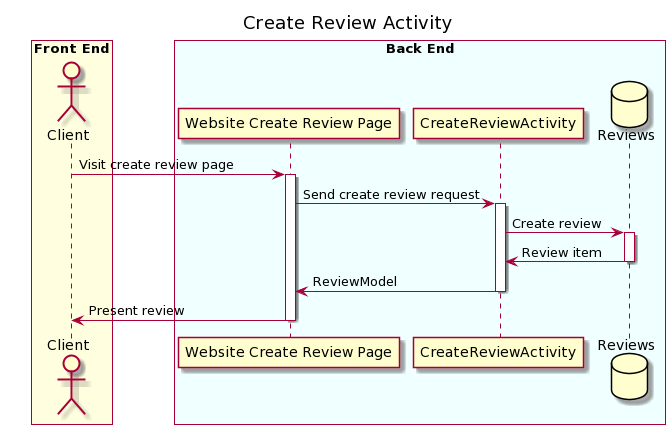

## 6.10 *GetParkReviewsActivity*
* Accepts `GET` requests to `/parks/{parkId}/reviews`.
* Accepts a park ID and returns the corresponding ReviewsModel.
   * If the park ID is not found, will throw a `ParkNotFoundException`.

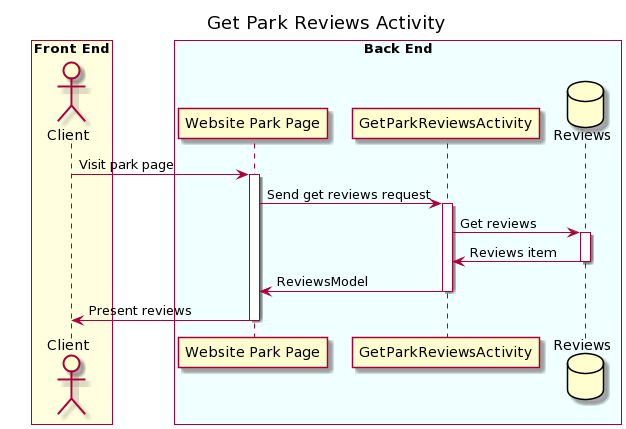

## 6.11 *UpdateReviewActivity*
* Accepts `PUT` requests to `/users/:userId/reviews/:reviewId`.
* Accepts data to update a review including a user ID, an updated review rating, 
  a park ID, and an optional text body. Returns the updated review.
   * If the user ID is not found, will throw a `UserNotFoundException`.
   * If the park ID is not found, will throw a `ParkNotFoundException`.
* For usability, we will limit the available ratings to only the numbers `1-5`.

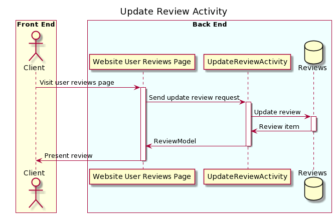

## 6.12 *DeleteReviewActivity*
* Accepts `DELETE` requests to `/users/:userId/reviews/:reviewId`
* Accepts data to delete a review including a user ID and a park ID.
  Returns the deleted ReviewModel.
   * If the user ID is not found, will throw a `UserNotFoundException`.
   * If the park ID is not found, will throw a `ParkNotFoundException`.

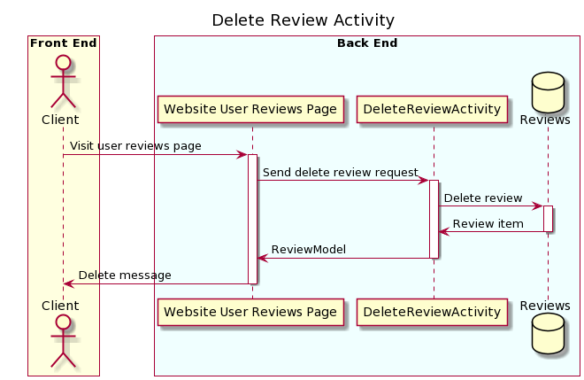

## 6.13 *GetUserReviewsActivity*
* Accepts `GET` requests to `/users/{userId}/reviews`.
* Accepts a user ID and returns the corresponding ReviewsModel.
    * If the user ID is not found, will throw a `UserNotFoundException`.


# 7. Tables

### 7.1 `parks`
```
id // partition key, string
name // string
location // string 
avgRating // number
tags // list
reviews // list
```

### 7.2 `locations`
```
locationName // partition key, string
parks // list
```

### 7.3 `users`
```
id // partition key, string
username // string
email // string
password // string
```

### 7.4 `reviews`
```
id // partition key, string
parkId // string
userId // string
rating // number
date // string
reviewBody // string
```

# 8. Pages

*Include mock-ups of the web pages you expect to build. These can be as
sophisticated as mockups/wireframes using drawing software, or as simple as
hand-drawn pictures that represent the key customer-facing components of the
pages. It should be clear what the interactions will be on the page, especially
where customers enter and submit data. You may want to accompany the mockups
with some description of behaviors of the page (e.g. “When customer submits the
submit-dog-photo button, the customer is sent to the doggie detail page”)*

## Main Parks Page with no filtering:
### `GET /parks` 
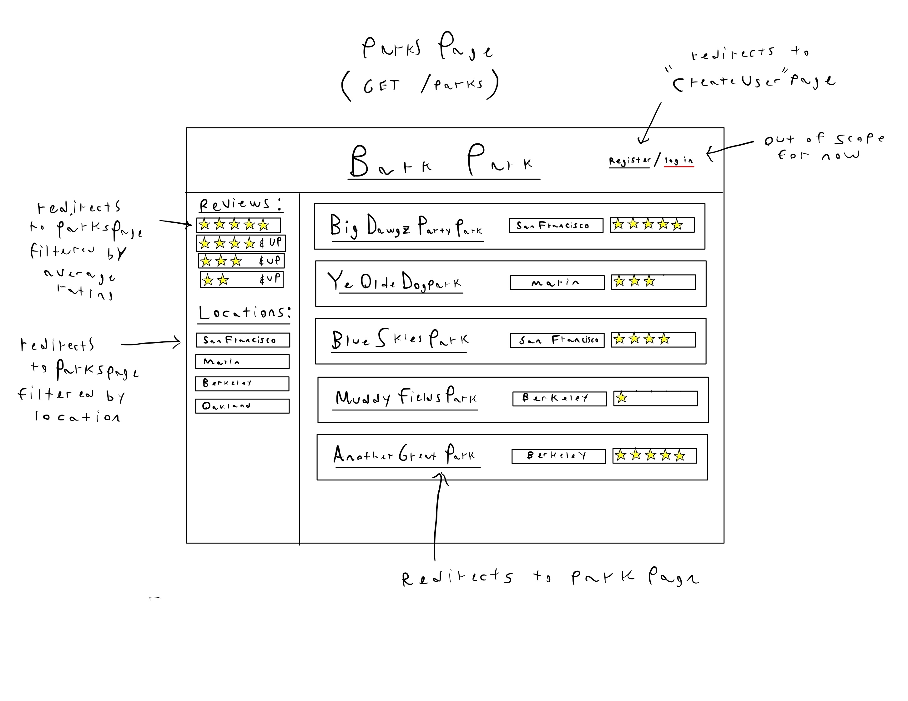

## Main Parks Page with no filtering:
### `/parks`


## Park Page
### `/parks/:parkId`
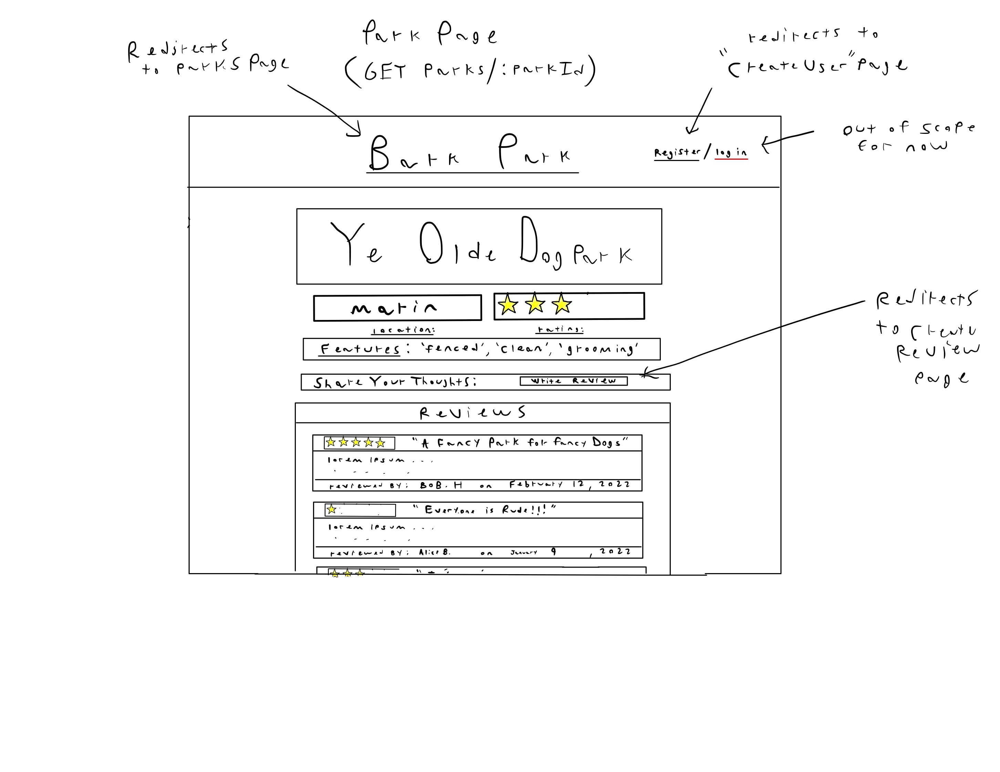

## Login/Create User Page
### `users/login`
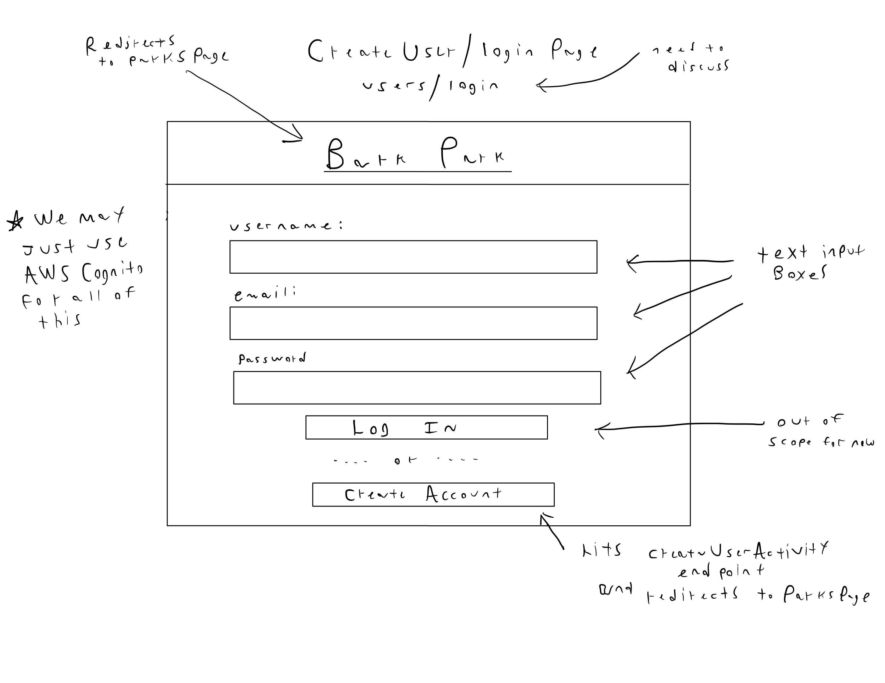

## User Page
### `users/:userId`
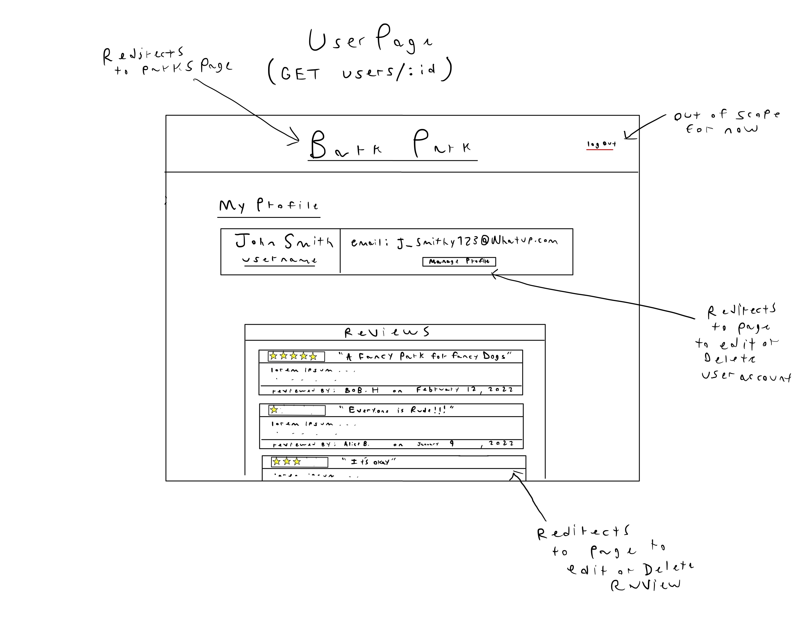

## Edit/Delete User Page
### `users/:userId/edit`
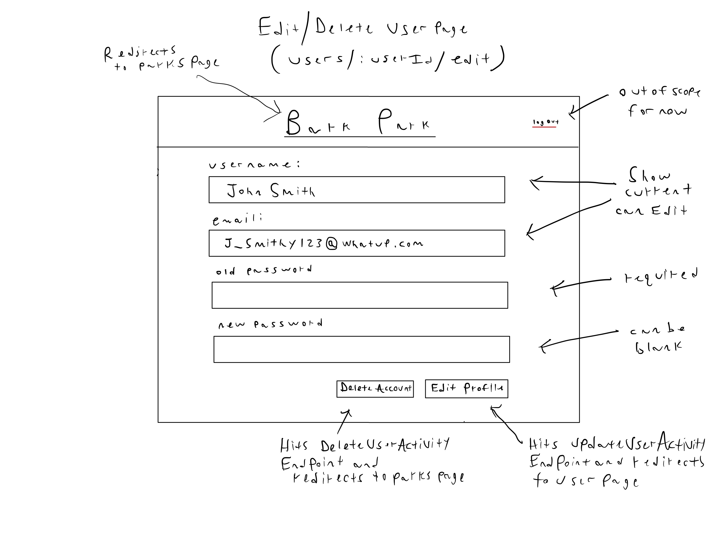

## Create Review Page
### `/parks/:parkId/reviews/create`
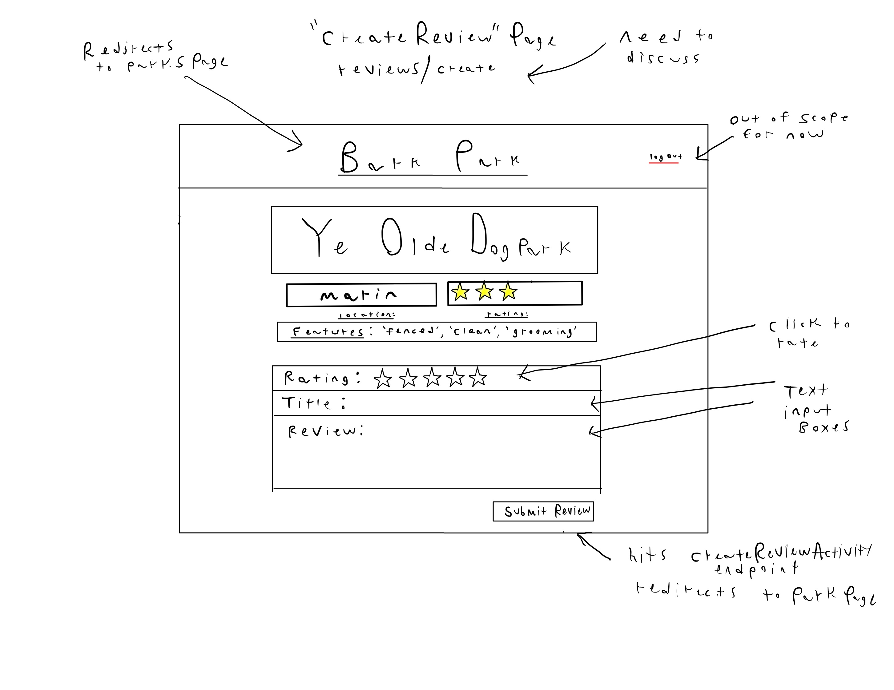

## Login/Create User Page
### `users/login`


## Review Page
### `/parks/:parkId/reviews/:reviewId`
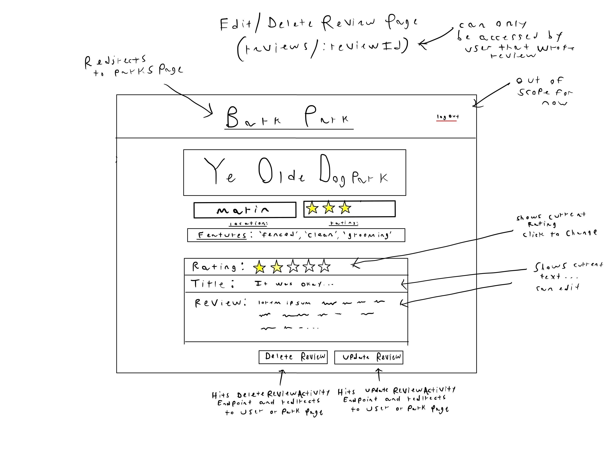

